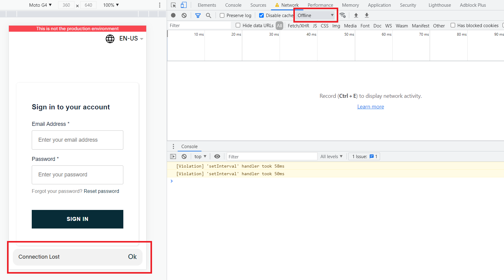
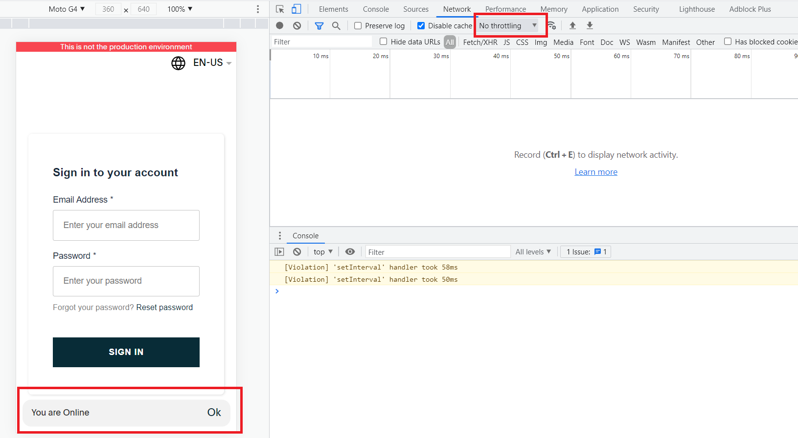

# Ngx-Check-Internet (Angular v2+)

> Detects whether browser has an active internet connection or not in Angular application.

## Demo

**Scenario 1** : Application was toggled to offline using Chrome Dev Tools Network Tab



**Scenario 2** : Application was toggled to online using Chrome Dev Tools Network Tab



## Install

You can get it on npm.

```
npm install ngx-check-internet
```

## Usage

### Import module ###

* Import `NgxCheckInternetModule` by adding the following to your parent module (i.e. `app.module.ts`):

    ```
    import { NgxCheckInternetModule } from 'ngx-check-internet';

    @NgModule({
      ...
      imports: [
        NgxCheckInternetModule,
        ...
      ],
      ...
    })
    export class AppModule {}
    ```

### Use in Component ###

1. Inject `NgxCheckInternetService` in Angular component's constructor.
2. Call start() function, it returns a Subject which will emit a boolean whenever internet connection status is changed. Subscribe to the subject to get push notifications.

```ts
import { Component } from '@angular/core';
import { NgxCheckInternetService } from 'ngx-check-internet';

@Component({
  selector: 'app-root',
  templateUrl: './app.component.html',
  styleUrls: ['./app.component.css']
})
export class AppComponent {

  constructor(private internetService: NgxCheckInternetService){}

  ngOnInit()
  {
    this.internetService.setConfig({
		interval: 3000,
		timeout: 5000,
	});

	// Subject to subscribe
	let liveInternetStatus = this.internetService.start();
	liveInternetStatus.subscribe(
		(response) =>
		{
			let isOnline = (response == true);
			let message = '';
			if (isOnline)
			{
				message = 'You are Online';
			}
			else
			{
				message = 'Connection Lost';
			}
			console.log(`Internet Status Changed. ${message}`);
		},
		(error) =>
		{
			console.error('NgxInternetService Subscription Error: ',error);
		}
	);
  }

}
```

## Configuration

```ts
this.internetService.setConfig({
	// The interval of time in milliseconds after which the urls will be fetched to get internet status. Default is 60000 (1 minute)
	interval: 3000,

	// The time in milliseconds after which http requests will be aborted (timed out) and internet status becomes false. Default value is 1000
	timeout: 5000,

	// a string[] which can contain upto 5000 urls. These urls are fetched (one url after) and a success http response indicates you are online.
	// Default value is an array of 5 urls from this github repository
	urls: [
		'https://raw.githubusercontent.com/souravs-2piradngx-check-internet/master/projects/ngx-check-internet/assets0.txt',
		'https://raw.githubusercontent.com/souravs-2piradngx-check-internet/master/projects/ngx-check-internet/assets1.txt',
	]
});
```


## License

[MIT License](https://github.com/souravs-2pirad/ngx-check-internet/blob/master/LICENSE) © Sourav Saraf